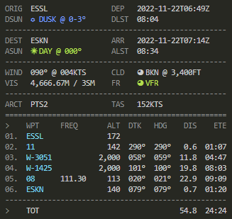

#  Aerofly Missionsgerät

The Aerofly Missionsgerät converts simulator flight plan files for [Aerofly FS 4](https://www.aerofly.com/) (`main.mcf` and `tmc`), Microsoft Flight Simulator (`pln`) and X-Plane (`fms`). It also imports Garmin flight plan files (`fpl`).

Head over to [https://fboes.github.io/aerofly-missions/dist/](https://fboes.github.io/aerofly-missions/dist/) to get started.

There is also a local Node.js CLI tool, if you want some automation for your workflow.

## Features

- Modify weather settings with live METAR information.
- Modify placement of flight plan checkpoints.
- Open flight plan in [SkyVector](https://skyvector.com/), including aircraft settings.
- Export [text briefings](docs/flightplan.md) and Markdown files, including weather and aircraft settings.

| Format                                                                                                                                              | Import | Export |
| --------------------------------------------------------------------------------------------------------------------------------------------------- | :----: | :----: |
| Aerofly FS `main.mcf`                                                                                                                               |   ✅   |        |
| Aerofly FS 4 `tmc` custom missions file                                                                                                             |   ✅   |   ✅   |
| [Microsoft FS `pln` flight plan file](https://docs.flightsimulator.com/html/Content_Configuration/Flights_And_Missions/Flight_Plan_Definitions.htm) |   ✅   |   ✅   |
| [X-Plane `fms` flight plan file](https://developer.x-plane.com/article/flightplan-files-v11-fms-file-format/)                                       |   ✅   |   ✅   |
| Garmin `fpl` flight plan file                                                                                                                       |   ✅   |        |
| `gpx` GPS Route file                                                                                                                                |   ✅   |        |
| [GeoJSON](https://geojson.org/)                                                                                                                     |  (✅)  |   ✅   |
| [SimBrief API](./docs/importing-flightplans.md)                                                                                                     |   ✅   |        |

## Local Node.js CLI tool

You will need the following software installed on your PC:

- [Aerofly FS 4](https://www.aerofly.com/)
- [Node.js](https://nodejs.org/en/) (Version 16+)
- Optional: [Windows Terminal](https://apps.microsoft.com/store/detail/windows-terminal/9N0DX20HK701) or use your pre-installed terminal

### Installation

1. Run `npm install -g aerofly-missions` from your terminal to globally install `aerofly-missions`.
2. Optional: You might want to put [a preconfigured batch file](docs/aerofly-missions.bat) on your desktop for ease of access.

### Updating

1. Run `npm install -g aerofly-missions` from your terminal to update `aerofly-missions` to the current version.

## Usage wit Aerofly FS 4

This manual is for Windows 10/11 installations. On other operating systems these steps are similar, but the file system locations will be different.

1. Open Aerofly FS 4, set up a flight plan, choose a aircraft, set time and weather. (You may want to use the [Aerofly Wettergerät](https://github.com/fboes/aerofly-wettergeraet/) to get weather data.)
1. Start the flight and check if the position of your aircraft is correct.
1. Quit Aerofly FS 4 so all your settings will be saved to your `main.mcf` configuration file, usually located at `C:\Users\…\Documents\Aerofly FS 4\main.mcf`.
1. Web version:
   1. Open https://fboes.github.io/aerofly-missions/dist/ and point the tool to the `main.mcf`.
1. Local version:
   1. Open the explorer and point it to the directory `main.mcf` is located, e.g. `Documents\Aerofly FS 4\`.
   1. Right click on the folder name and choose "Open in terminal".
   1. Run `aerofly-missions` in the open terminal to convert `main.mcf` to a `tmc` file (see below).
1. Grab your exported `tmc` file with all your settings converted into a single mission file. This file can now be placed into the custom mission directory in Aerofly FS 4.

Be aware that right now Aerofly FS 4 accepts custom missions exclusively from within `…\Aerofly FS 4 Flight Simulator\missions\custom_missions_user.tmc`. See [installation instructions](https://fboes.github.io/aerofly-missions/docs/generic-installation.html) on how to get started.

See the [custom missions documentation](docs/custom-missions.md) for more information. See also [more sources for flight plans on the Internet](docs/importing-flightplans.md).

## Status

## Legal stuff

Author: [Frank Boës](https://3960.org)

Copyright & license: See [LICENSE.txt](LICENSE.txt)

This tool is NOT affiliated with, endorsed, or sponsored by IPACS GbR. As stated in the [LICENSE.txt](LICENSE.txt), this tool comes with no warranty and might damage your files.

This software complies with the General Data Protection Regulation (GDPR) as it does not collect nor transmits any personal data to third parties.
